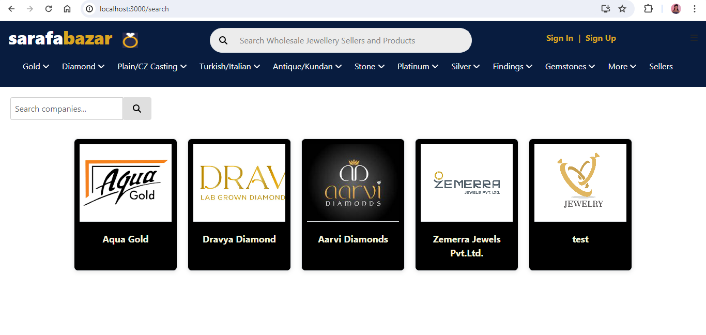
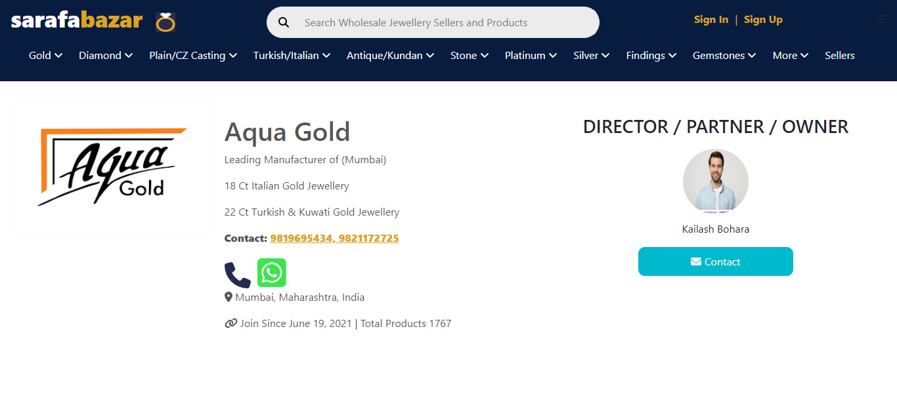
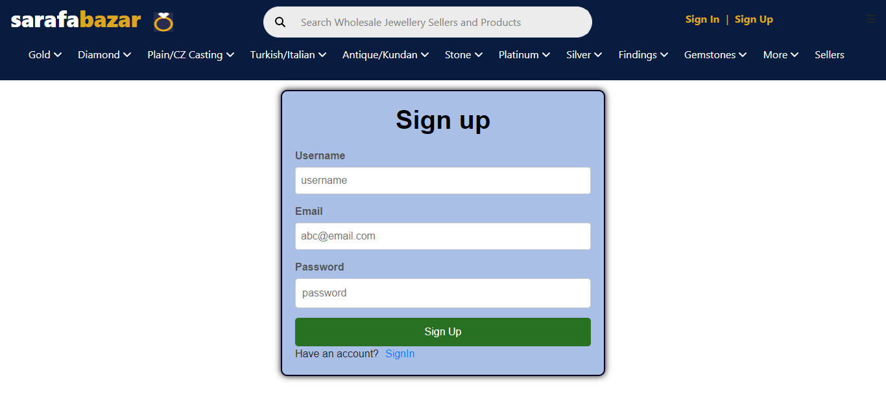
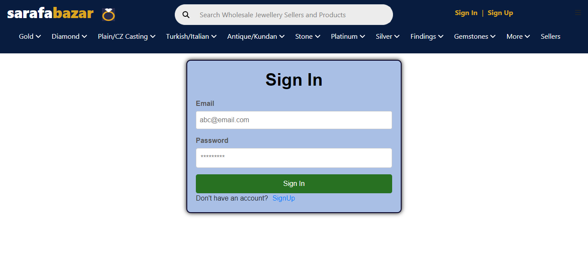

# Jewelry Store (Frontend )

This project implements a Jewelry Store Management System backend using Node.js, Express, MongoDB, and other libraries.

## Snapshots

- **Dashboard**


- **Search Page**



- **Company Details Page**



- **Signup Page**



- **Sign In Page**




## Features

- Display company details including name, description, address, contact information, and owner details.
- Search company by its name.
- Option to contact the company using a modal form.
- Responsive design using CSS modules for styling.

## Installation

To run this project locally, follow these steps:

1. Clone the repository.
2. Navigate to the project directory:
3. Install the necessary dependencies:

```
npm install
```

4. Run the project.

```
npm start

```

5. Open http://localhost:3000 in your browser to view the application.

## Usage

- Navigate to the search page to view a list of companies.
- Click on a company to view detailed information.
- Click on the "Contact" button or link to open a modal form and send a query to the company.

## Technologies Used

- React.js
- Axios
- React Router DOM
- Font Awesome
- CSS Modules

## Authors

- [@Snehal](https://github.com/Snehal-Salvi)
